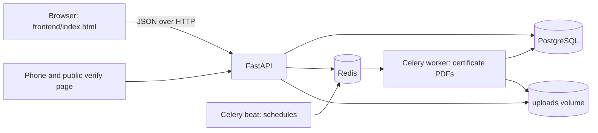

# Club Activities Tracker

A multi-campus platform for club activities: join requests, club days with a rotating-QR check-in, submissions with rubric scoring, verifiable PDF certificates, events with teams, and dashboards that reconcile with the raw data.

Backend: FastAPI, PostgreSQL, Redis, Celery. Frontend: one static HTML file (no build step).

## Status

| Area | State |
|---|---|
| Auth and 5 roles with row-level scoping | Done |
| Clubs, memberships (1 primary + 1 secondary, capacity) | Done |
| Club days lifecycle, plan approval, scheduler | Done (7-day, 48-hour and 5-day reminders are scheduled stubs) |
| Rotating-QR check-in, late flag, geo flag, corrections with a reason | Done |
| Submissions (file, photo, link), deadlines, rubric scoring | Done |
| Certificates: PDF, tamper detection, public verify page, revocation | Done |
| Events: registration, teams, check-in, results | Done |
| Dashboards, monthly report, CSV export | Done |
| Load test (100, 300, 500 concurrent check-ins) | Done, see TEST_REPORT.md |
| Event certificates, transcript, budgets, Duty Leave, gallery, WhatsApp | Not built |
| Delivery of notifications (rows are queued, nothing is sent) | Not built |

## Quick start

```
cp .env.example .env        # then set the secrets (see below)
docker compose up --build
docker compose exec api python -m scripts.seed      # demo users
cd frontend && python3 -m http.server 5500          # open http://localhost:5500
```

- API docs: http://localhost:8000/docs
- Generate secrets with: python3 -c "import secrets; print(secrets.token_hex(32))" and put the result in JWT_SECRET (and optionally CERT_SECRET) in .env.
- The SQL files in backend/migrations run automatically, in order, only on the first start with an empty database. On an existing database, apply a new one with:
  docker compose exec -T db sh -c 'psql -U "$POSTGRES_USER" -d "$POSTGRES_DB"' < backend/migrations/00X_name.sql
- To open the frontend from a phone, use your computer's IP address and change the API address field on the login screen.

Demo logins (password: password123): s001@demo.edu, s002@demo.edu, s003@demo.edu (students), coord@demo.edu, advisor@demo.edu, admin@demo.edu (campus admin), super@demo.edu, n001@demo.edu (student on another campus). Remove the demo users before any real deployment.

## Architecture



## Design decisions

- **Check-in integrity.** The QR carries a token computed as HMAC(session secret, session id and a 25-second time step). It is computed, not stored. The server accepts the current and the previous step, so a screenshot is useless after about 50 seconds. The scan path is one Redis read, one HMAC check, one Redis SET NX duplicate guard and one database insert. The real duplicate guard is UNIQUE(student_id, session_id) in PostgreSQL. Geo and late checks only set flags; they never block. Corrections need a reason and are written to the audit log.
- **Certificate verification.** Two independent checks. An HMAC over the certificate fields (including a frozen snapshot of names and dates) is recomputed on every verify, so editing a database row is detected. The SHA-256 of the PDF bytes is stored, so an edited PDF fails. The verify page is public and shows no student code, email or revoke reason. If the record fails its check, it shows no details.
- **No overselling.** Event registration and team changes lock the event row first (SELECT FOR UPDATE), then check capacity. Unique constraints are the second line of defence.
- **Dashboards reconcile.** Every figure is SQL over the raw tables. The monthly report is computed per club and as raw totals, and the response says whether they match.
- **Access control.** One reusable permission dependency plus SQL-level scoping, so a coordinator's query never returns another club's rows.
- **Heavy work stays out of requests.** PDFs are rendered by the Celery worker. A sweeper task re-queues anything lost.

## Tests

```
docker compose exec api pytest tests/unit
docker compose exec api python -m scripts.smoke     # also smoke3, smoke4, smoke5, smoke6
bash loadtest/run.sh                                # needs Docker; takes a few minutes
```

Results, what each script covers, and what is not covered are in TEST_REPORT.md. Raw outputs are in test-results/ and loadtest/results/.

## Repository layout

```
backend/app/        routers, services, core (permissions, state machines, audit)
backend/workers/    Celery app, scheduled tasks, certificate generation
backend/migrations/ SQL schema, one file per stage
backend/scripts/    seed data, smoke tests, load-test data prep
frontend/index.html the whole client
loadtest/           k6 script, driver, report builder, results
docs/               PRIVACY.md, COST.md
```

## Known limitations

- CORS is open to every origin and there is no HTTPS (development settings).
- No rate limiting on the public verify endpoints, only a 5 MB upload cap.
- Login tokens last 8 hours and carry the role, so a role change takes effect at the next login.
- There is no endpoint to deactivate or delete a user.
- Files are stored on a local Docker volume, not S3.
- Camera QR scanning works in Chrome and Edge only; other browsers type the shown code.
- Certificates with non-Latin names need an extra font package in the Docker image.

## Credits

FastAPI, Uvicorn, asyncpg, PostgreSQL, Redis, Celery, WeasyPrint, segno, k6, qrcodejs, bcrypt, PyJWT, Pydantic, Docker. Code was written with assistance from Claude (Anthropic).
