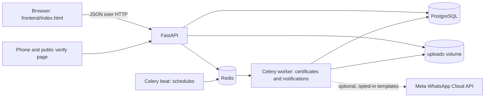

# Club Activities Tracker

A multi-campus platform for club activities: join requests, club days with a rotating-QR check-in, submissions with rubric scoring, verifiable PDF certificates, events with teams, and dashboards that reconcile with the raw data.

Backend: FastAPI and PostgreSQL. Production can use Redis and Celery; local mode runs without them. Frontend: one static HTML file (no build step).

## Status

| Area | State |
|---|---|
| Auth and 5 roles with row-level scoping | Done |
| Campus and account provisioning; club descriptions and registry editing | Done |
| Clubs, memberships (1 primary + 1 secondary, capacity) | Done |
| Club days lifecycle, plan approval, scheduler | Done (announcement and in-app reminders at 7 days, 48 hours and 5 days) |
| Rotating-QR check-in, late flag, geo flag, corrections with a reason | Done |
| Submissions (file, photo, link), deadlines, rubric scoring | Done |
| Certificates: PDF, tamper detection, public verify page, revocation | Done |
| Events: registration, teams, check-in, results | Done |
| Dashboards, monthly report, top contributors and CSV export | Done |
| Academic calendar CSV import, club approval, meeting rules and presenter records | Done |
| Load test (100, 300, 500 concurrent check-ins) | Done, see TEST_REPORT.md |
| Event certificates, transcript, budgets, Duty Leave, gallery | Implemented in the backend (migration 008 required) |
| In-app notification inbox, read state and scheduled reminders | Done |
| WhatsApp Cloud API template delivery | Implemented; optional and disabled until configured |
| Email and push notification delivery | Not built |

## Run locally without Docker

Local mode runs the API, frontend, scheduled jobs, and certificate queue without Docker, Redis, or Celery. PostgreSQL 16 is the one local service because the app relies on PostgreSQL-specific SQL, JSONB, and row locking to preserve its existing workflows.

```sh
brew install python@3.12 postgresql@16 pango
python3.12 -m venv .venv
source .venv/bin/activate
pip install -r backend/requirements.txt
./scripts/run_local.sh --demo
```

Open http://127.0.0.1:5500 and sign in with a demo account (password: `password123`). API docs are at http://127.0.0.1:8000/docs. PostgreSQL data, generated uploads, and a local JWT secret persist under `.local/`. The check-in cache is in memory and clears on restart. Use `./scripts/run_local.sh` without `--demo` to skip demo data. The PostgreSQL server stays running after the app exits so its data remains available; stop it with `$(brew --prefix postgresql@16)/bin/pg_ctl -D .local/postgres stop`.

If multiple Python versions are installed, activate the virtual environment before launching, or set `PYTHON_BIN=python3.12`. If PostgreSQL tools are installed outside the standard Homebrew location, set `PG_BIN` to the installation's `bin` directory. WhatsApp delivery still needs Meta credentials, an approved template, network access, and user opt-in.

## Quick start

The existing Docker setup remains available for the multi-container production-style path:

```
cp .env.example .env        # then set the secrets (see below)
docker compose up --build
docker compose exec api python -m scripts.seed      # demo users
cd frontend && python3 -m http.server 5500          # open http://localhost:5500
```

- API docs: http://localhost:8000/docs
- Campus managers and program managers can create accounts from the **Administration** tab; program managers can also add campuses. Existing databases must apply migrations `006_notifications.sql` through `010_whatsapp_delivery.sql` in order.
- Generate secrets with: python3 -c "import secrets; print(secrets.token_hex(32))" and put the result in JWT_SECRET (and optionally CERT_SECRET) in .env.
- The SQL files in backend/migrations run automatically in the local launcher on a new local database, or on first Docker start with an empty volume. For an existing Docker database, apply migrations with:
  docker compose exec -T db sh -c 'psql -U "$POSTGRES_USER" -d "$POSTGRES_DB"' < backend/migrations/00X_name.sql
- For an existing local database, use `psql "$DATABASE_URL" -v ON_ERROR_STOP=1 -f backend/migrations/00X_name.sql` after setting `DATABASE_URL` to the local connection string.
- To open the frontend from a phone, use your computer's IP address and change the API address field on the login screen.
- WhatsApp is optional. Set `WHATSAPP_ACCESS_TOKEN`, `WHATSAPP_PHONE_NUMBER_ID`, `WHATSAPP_GRAPH_API_VERSION`, `WHATSAPP_TEMPLATE_NAME`, and optionally `WHATSAPP_TEMPLATE_LANGUAGE` in `.env`. The approved Meta template must accept exactly two body text parameters. Users separately enter their own international-format number and opt in from **Notifications**. Leave the credentials blank to keep outbound WhatsApp disabled. Apply migration `010_whatsapp_delivery.sql` to an existing database.

Demo logins (password: password123): s001@demo.edu, s002@demo.edu, s003@demo.edu (students), coord@demo.edu, advisor@demo.edu, admin@demo.edu (campus admin), super@demo.edu, n001@demo.edu (student on another campus). Remove the demo users before any real deployment.

## Architecture



The diagram shows production mode. Local mode uses the same PostgreSQL database, but stores check-in cache entries in process memory and runs scheduled/certificate jobs inside the API process. It does not start Redis, Celery worker, or Celery beat.

## Design decisions

- **Check-in integrity.** The QR carries a token computed as HMAC(session secret, session id and a 25-second time step). It is computed, not stored. The server accepts the current and the previous step, so a screenshot is useless after about 50 seconds. Production uses a Redis cache guard; local mode uses an in-memory cache. The real duplicate guard is UNIQUE(student_id, session_id) in PostgreSQL. Geo and late checks only set flags; they never block. Corrections need a reason and are written to the audit log.
- **Certificate verification.** Two independent checks. An HMAC over the certificate fields (including a frozen snapshot of names and dates) is recomputed on every verify, so editing a database row is detected. The SHA-256 of the PDF bytes is stored, so an edited PDF fails. The verify page is public and shows no student code, email or revoke reason. If the record fails its check, it shows no details.
- **No overselling.** Event registration and team changes lock the event row first (SELECT FOR UPDATE), then check capacity. Unique constraints are the second line of defence.
- **Dashboards reconcile.** Every figure is SQL over the raw tables. The monthly report is computed per club and as raw totals, and the response says whether they match.
- **Access control.** One reusable permission dependency plus SQL-level scoping, so a coordinator's query never returns another club's rows.
- **Heavy work stays out of requests.** PDFs are rendered by a worker: Celery in production and an in-process queue in local mode. A sweeper re-queues any lost jobs.
- **Local runtime.** `APP_MODE=local` uses process-local caching and in-process background jobs. `APP_MODE=production` uses Redis and Celery. Both modes share PostgreSQL.

## Tests

```
python -m pytest backend/tests/unit
docker compose exec api pytest tests/unit
docker compose exec api python -m scripts.smoke     # also smoke3, smoke4, smoke5, smoke6
bash loadtest/run.sh                                # needs Docker; takes a few minutes
```

Results, what each script covers, and what is not covered are in TEST_REPORT.md. Raw outputs are in test-results/ and loadtest/results/.

## Repository layout

```
backend/app/        routers, services, core (permissions, state machines, audit)
backend/workers/    Celery app, scheduled tasks, certificate generation
backend/migrations/ SQL schema, one file per stage
backend/scripts/    seed data, smoke tests, load-test data prep
frontend/index.html the whole client
loadtest/           k6 script, driver, report builder, results
docs/               PRIVACY.md, COST.md
```

## Known limitations

- CORS is open to every origin and there is no HTTPS (development settings).
- No rate limiting on the public verify endpoints, only a 5 MB upload cap.
- Login tokens last 8 hours and carry the role, so a role change takes effect at the next login.
- There is no endpoint to deactivate or delete a user.
- Notifications appear in the in-app inbox. WhatsApp template delivery is implemented but remains disabled until Meta credentials, a matching approved template, migration 010, and user opt-in are all present. Email and push delivery are not built.
- Inter-college events require campus-admin approval before students from other campuses can discover or register. Registrations create Duty Leave requests for the student's campus.
- Event galleries require uploader publication consent and campus-admin moderation before photos are visible in the shared gallery.
- Existing databases must apply `backend/migrations/008_extended_modules.sql`; fresh databases apply it after the base migrations.
- Existing databases must also apply `backend/migrations/009_problem5_requirements.sql`; it adds club approval state, activity venues, and International Conference/Other event types. Club Day calendar CSVs use `day_date` (YYYY-MM-DD), optional `title`, and optional timezone-aware `submission_deadline` columns.
- Files are stored on local disk (`.local/uploads` for the local launcher), not S3.
- Camera QR scanning works in Chrome and Edge only; other browsers type the shown code.
- Certificates with non-Latin names may need an additional font installed on the host or in the Docker image.

## Credits

FastAPI, Uvicorn, asyncpg, PostgreSQL, optional Redis and Celery, WeasyPrint, segno, k6, qrcodejs, bcrypt, PyJWT, and Pydantic. Code was written with assistance from Claude (Anthropic).
